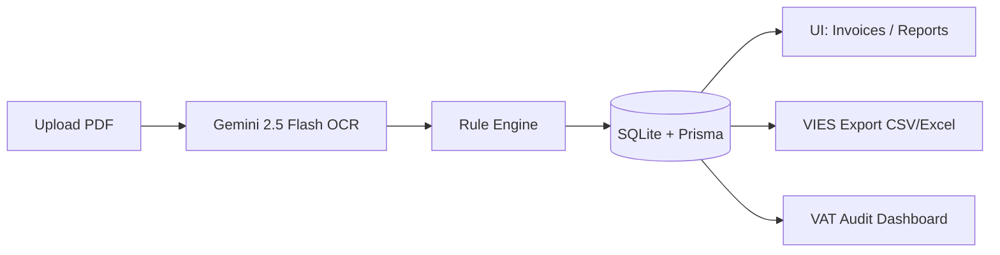

# 14-MobileRepairs myDATA Helper

Εφαρμογή για διαχείριση Ελληνικών τιμολογίων myDATA / VIES / VAT.

## 🎯 Σκοπός

Αυτοματοποίηση της ταξινόμησης και αναφοράς Ελληνικών τιμολογίων για:
- **myDATA (AADE)** - Υποβολή τιμολογίων
- **VIES (Φ5)** - Έκθεση ενδοκοινοτικών συναλλαγών
- **VAT Audit** - Έλεγχος ΦΠΑ (364, 365, 361, reverse charge)

---

## 🏗️ Αρχιτεκτονική



---

## 📊 4 Κατηγορίες Ταξινόμησης

| Κατηγορία | myDATA Τύπος | ΦΠΑ | VIES Στήλη | Παράδειγμα Προμηθευτή |
|-----------|-------------|-----|------------|----------------------|
| **Ενδοκοινοτικές Αποκτήσεις Αγαθών** | `14.1` | 0% | Στήλη 5 (Αγαθά) | Provisions Ltd (HU) |
| **Ενδοκοινοτική Λήψη Υπηρεσιών (Reverse Charge)** | `14.3` | 0% | Στήλη 7 (Υπηρεσίες) | TechServices, CloudHost, AIProvider (IE/DE) |
| **OSS (24% Ελληνικό ΦΠΑ)** | `14.3`/`11.4` | 24% | **Εξαιρείται** | DigitalServices (IE) |
| **Εγχώρια Ελληνικά** | `1.1` | 24% | **Εξαιρείται** | LocalCourier, LocalSoftware (GR) |

---

## 🚀 Quick Start

```bash
# Clone & Setup
git clone https://github.com/makpapad/14-MobileRepairs-myDATA-Helper.git
cd 14-MobileRepairs-myDATA-Helper
npm install

# Database setup (SQLite)
npx prisma migrate dev --name init
npx prisma db seed

# Development
npm run dev
# → http://localhost:3000
```

---

## 🔧 Environment Variables

```env
# Database (SQLite for dev)
DATABASE_URL="file:./dev.db"

# AI Extraction (optional)
GEMINI_API_KEY="your-gemini-api-key"

# myDATA Production (when ready)
# MYDATA_API_URL="https://mydata-prod.azure-api.net"
# MYDATA_API_KEY="your-mydata-key"
# MYDATA_USER_ID="your-user-id"
```

---

## 📱 Σελίδες

| Σελίδα | URL | Λειτουργία |
|--------|-----|------------|
| Dashboard | `/` | Επισκόπηση + πρόσφατα τιμολόγια |
| Λίστα Τιμολογίων | `/invoices` | Φίλτρα: μήνας, status, VIES, reverse charge |
| Upload PDFs | `/invoices/upload` | Drag & drop multiple PDFs |
| Λεπτομέρειες | `/invoices/[id]` | Επεξεργασία, έγκριση, ταξινόμηση |
| VIES Report | `/reports/vies` | Φ5 export CSV/Excel |
| VAT Report | `/reports/vat` | VAT audit dashboard |

---

## 🤖 AI Integration (Gemini 2.5 Flash)

```bash
# Extract structured data from PDF
POST /api/gemini-extract
Content-Type: multipart/form-data
files: [PDF files...]

# Response
{
  "supplierName": "DigitalServices IE",
  "supplierVat": "9825613N",
  "supplierCountry": "IE",
  "invoiceNumber": "DS-2026-05",
  "invoiceDate": "2026-05-15",
  "netAmount": 9.99,
  "vatAmount": 1.93,
  "grossAmount": 11.92,
  "vatRate": 24,
  "isReverseCharge": false,
  "mydataInvoiceType": "14.3",
  "expenseCategory": "2.4 Γενικά Έξοδα με δικαίωμα έκπτωσης ΦΠΑ",
  "e3Code": "E3_585_016",
  "vatClassification": "366-Φ2",
  "viesEligible": false,
  "viesColumn": "NONE"
}
```

---

## 🧠 Supplier Registry

Μαθαίνει από διορθώσεις χρήστη:

```bash
# Single correction
POST /api/learn-correction
{ "invoiceId": "...", "corrections": { "myDataInvoiceType": "14.1", ... } }

# Batch corrections
POST /api/batch-learn
{ "corrections": [{ "invoiceId": "...", "corrections": {...} }, ...] }
```

Αποθηκεύει στο `SupplierRegistry` για αυτόματη ταξινόμηση επόμενων τιμολογίων.

---

## 📦 API Endpoints

| Endpoint | Method | Description |
|----------|--------|-------------|
| `/api/invoices/upload` | POST | Upload PDFs → extract → classify → save |
| `/api/invoices/[id]` | GET/PATCH/DELETE | CRUD για τιμολόγιο |
| `/api/classify` | POST | Test classification από κείμενο |
| `/api/gemini-extract` | POST | AI extraction από PDF |
| `/api/learn-correction` | POST | Μάθηση από μία διόρθωση |
| `/api/batch-learn` | POST | Μαζική μάθηση |
| `/api/mydata-submit` | POST | Υποβολή στο myDATA (stub) |
| `/api/reports/vies` | GET | VIES export (CSV/Excel) |

---

## 🧪 Testing & Quality

```bash
npm test           # 7 classification tests
npm run lint       # ESLint
npm run build      # Production build (11 routes)
```

---

## 🛠️ Tech Stack

| Category | Technology |
|----------|------------|
| Framework | Next.js 15 (App Router) |
| Database | SQLite (dev) / PostgreSQL (prod) + Prisma ORM |
| AI | Google Gemini 2.5 Flash (@google/genai) |
| PDF Parsing | pdf-parse |
| Validation | Zod |
| Styling | Tailwind CSS (custom components) |
| Testing | Vitest |
| Language | TypeScript (strict) |

---

## 📁 Project Structure

```
14-MobileRepairs-myDATA-Helper/
├── app/
│   ├── api/                 # API Routes (9 endpoints)
│   ├── invoices/            # Invoice pages
│   └── reports/             # VIES/VAT reports
├── prisma/
│   ├── schema.prisma        # Active schema (SQLite)
│   ├── schema.sqlite.prisma # SQLite template
│   ├── seed.ts              # Sample data (7 suppliers, 5 invoices)
│   └── migrations/          # Migration history
├── src/
│   ├── lib/
│   │   ├── classification/  # Rule engine (4 categories)
│   │   ├── validation/      # Zod schemas
│   │   ├── gemini/          # AI extraction
│   │   ├── invoices/        # Business logic
│   │   ├── pdf/             # PDF parsing
│   │   ├── reports/         # VIES/VAT builders
│   │   └── db/              # Prisma client + queries
│   └── test/                # Vitest tests
└── scripts/
    ├── switch-db.sh         # Linux/Mac DB switcher
    └── switch-db.bat        # Windows DB switcher
```

---

## 🔄 Database Switching

```bash
# Development (SQLite - default)
./scripts/switch-db.sh sqlite

# Production (PostgreSQL)
./scripts/switch-db.sh postgres
# Then: npx prisma migrate deploy
```

---

## 📚 Documentation

- **[DAILY_COMMANDS.md](DAILY_COMMANDS.md)** - Developer cheatsheet
- **[Docs/gemini-code-...md](Docs/gemini-code-1785152333367.md)** - AI classification rules
- **[Docs/mobilerepairs_export.sql](Docs/mobilerepairs_export.sql)** - Full SQL schema export

---

## 📄 License

ISC License